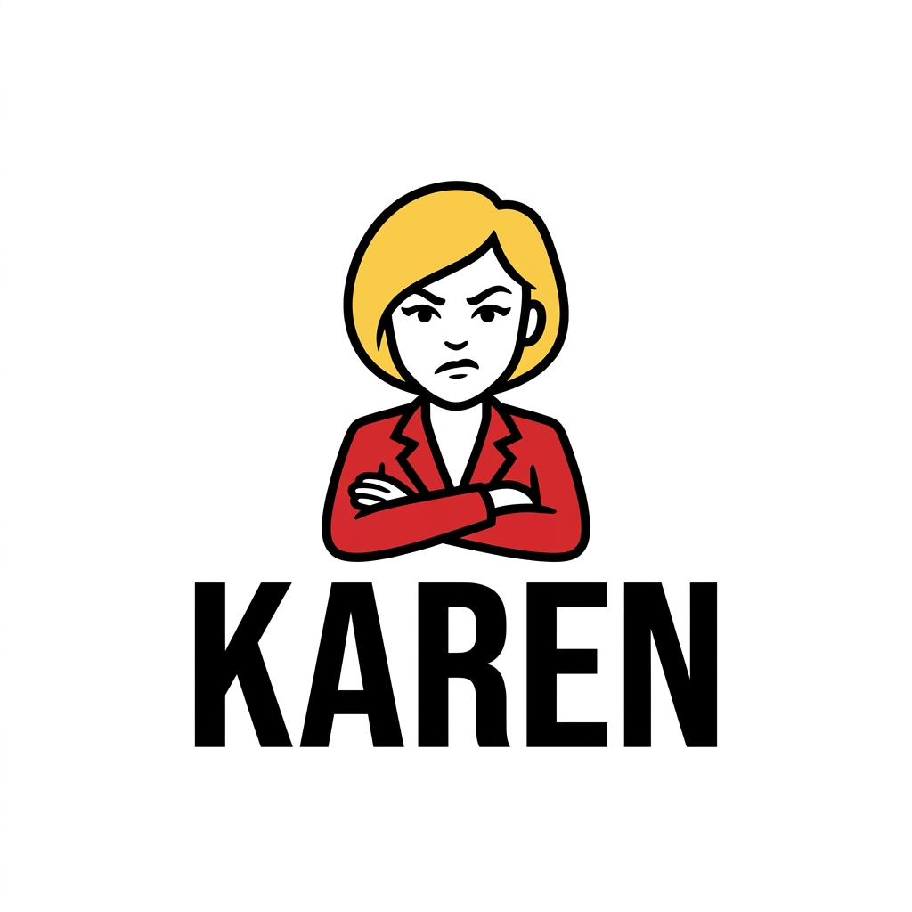

<p align="center">
  
</p>

<p align="center"><em>Karen needs to speak to your manager before this ships.</em></p>

<p align="center">
  <a href="LICENSE"></a>
  <a href="EVALS-PLAN.md"></a>
</p>

## What Karen is

Karen is a **skill and plugin for AI coding agents** — Claude Code, Codex, Cursor, and anything else with tool-use. She has no CLI of her own and doesn't run standalone. She runs inside the agent.

She's a harness architect, not a linter. She interviews you, surveys your project, and designs a custom quality-gate harness — shell scripts wired to your own tools (semgrep, eslint, govulncheck, whatever your project actually uses), committed to your repo, run on every audit. The agent runs them, reads Karen's verdict, and doesn't get to decide "looks good" instead.

```
[karen audit]

Karen is reviewing your project.

GATE 1  supply-chain    Karen is satisfied.  (0 issues)
GATE 2  completeness    Karen has complaints.  (3 issues)
  src/session.py:44     exported `start_stream` — no docstring
  src/agents.py:112     exported `delete_agent` — no test
GATE 3  security        Karen has complaints.  (1 issue)
  src/wire.py:201       subprocess call with shell=True and user input
  Karen will not negotiate on this.

Karen has 4 complaints. She will not let this ship. Fix it and try again.

EXIT 1
```

Full transcript examples and the reasoning behind every gate live in [BLUEPRINT.md](BLUEPRINT.md).

## Status

This repository is currently a **design specification and eval benchmark**, not an installable skill. [BLUEPRINT.md](BLUEPRINT.md) is the authoritative spec — every gate, every mechanic, every piece of Karen's voice is defined there before a line of the skill itself gets written. [`evals/`](evals/) is a working benchmark that scores whatever Karen implementation eventually exists against 14 hand-built fixtures across 10 grading dimensions, built and self-validated ahead of Karen so the benchmark can't be accused of grading itself favorably. See [EVALS-PLAN.md](EVALS-PLAN.md) for why this order matters and what's still ahead of it.

## How she works

- **Detects** — reads manifests, CI config, existing tests, agent-context files, and every quality-gate-like script already in the project, so she never re-asks what she can already see.
- **Interviews** — a real conversation, not a fixed form, for whatever detection couldn't answer: deployment context, audience, regulatory environment, sensitive capabilities.
- **Generates** — gate scripts written by the agent itself, each one a thin wrapper calling the tool that actually owns that domain. Karen doesn't reimplement semgrep; she wires it in.
- **Audits, and remembers.** Re-runs after every fix, not just the gate you touched. Tracks delta ("2 fewer complaints") across runs. Trips a circuit breaker if the same fix fails three times running, so a stuck agent escalates to a human instead of burning tokens on a fourth identical attempt.

Read [BLUEPRINT.md](BLUEPRINT.md) for the full mechanics: the gate contract, run state and fingerprinting, every quality dimension Karen knows about, and every deployment-context profile from `browser-direct-js` to `ai-agent`.

## The eval benchmark

Karen's whole pitch is a set of empirical claims — she catches real issues, she doesn't flag safe look-alikes, she knows when to stop. Empirical claims need a benchmark, not a demo. [`evals/`](evals/) is an OWASP-Benchmark-style suite: 14 fixtures across Node, Go, and Python, 10 grading dimensions, every fixture validated against hand-authored golden/broken samples before Karen exists to run against it for real.

[EVALS-PLAN.md](EVALS-PLAN.md) has the full design rationale and citations, plus a section on what it takes to run this as a durable, public-facing benchmark rather than an internal QA tool — held-out fixtures, judge calibration, benchmark versioning, and more.

## Repository layout

| Path | What's in it |
|---|---|
| [`BLUEPRINT.md`](BLUEPRINT.md) | The authoritative design spec — read this first |
| [`EVALS-PLAN.md`](EVALS-PLAN.md) | Eval benchmark design rationale, methodology, citations |
| [`evals/`](evals/) | The benchmark itself — fixtures, graders, runner, self-test |
| [`brand/`](brand/BRAND.md) | Voice, palette, typography, and logo assets |

## Brand

Karen has a specific voice and a specific look. [`brand/BRAND.md`](brand/BRAND.md) is the single source of truth for both, from CLI copy to a future website. Two colors, no green for "pass," and a mascot that never smiles.

## Contributing

This project is early and design-first: most contributions should engage with [BLUEPRINT.md](BLUEPRINT.md) or [EVALS-PLAN.md](EVALS-PLAN.md) before touching code. Open an issue or PR against whichever doc your change affects.

## License

[MIT](LICENSE) © 2026 Zohar Babin
